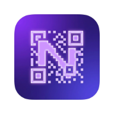
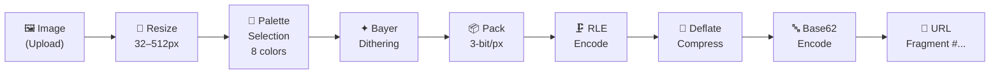
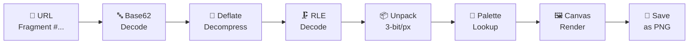

<div style="display: flex; justify-content: center; align-items: center; flex-direction: column;">

<h1>🔮 NanoGlyph — Share Images Without Internet</h1>
<br>
<br>
</div>

> [!NOTE]  
> What if you could share photos using just a URL — no server, no cloud, no internet required?

NanoGlyph is an offline-first Progressive Web App (PWA) that encodes images into compact, URL-safe text. Share images via messaging apps on restrictive WiFi networks, air-gapped environments, or anywhere traditional image sharing fails.

> [!TIP]
> **[🚀 Try it Live](https://ghagui.github.io/NanoGlyph-Share/)**

---

## 💡 Why NanoGlyph?

The idea came from a real frustration: **restrictive WiFi networks** (airports, hotels, corporate) that block image uploads but allow text messages. What if the image *was* the message?

NanoGlyph solves this by:
- **Encoding** any image into a compact Base62 string
- **Embedding** it directly in the URL fragment (`#...`)
- **Decoding** it entirely in-browser — no server ever sees the data

The entire image lives in the link. Send it via WhatsApp, Telegram, SMS, email — anything that can carry text.

---

## ✨ Features

| Feature | Description |
|---------|-------------|
| 🎨 **99 Color Palettes** | 20 hand-crafted + 79 procedural palettes with real-time preview |
| 📱 **Platform-Aware Chunking** | Auto-splits URLs for WhatsApp (32K), Telegram (4K), Messenger (2K), Instagram (1K) |
| 🖼️ **Multi-Format Support** | PNG, JPEG, GIF, WebP, BMP, HEIF/HEIC — including animations |
| 💾 **Save as PNG** | Download received images directly to your gallery with one tap |
| 🔒 **Zero Server** | Everything runs in your browser via WebAssembly — no data leaves your device |
| 📶 **Offline-First** | Service Worker caches everything — works without internet after first visit |
| ⚡ **Rust + WebAssembly** | Image processing at near-native speed using Bayer dithering and RLE compression |
| 🎚️ **Quality Control** | Tiny (32px) to Maximum (512px) — you choose the tradeoff |

---

## 🔧 How It Works

### Encoding Pipeline



### Decoding Pipeline



**Step by step:**

1. **Resize** — Scale to target dimension (32–512px) preserving aspect ratio
2. **Palette** — Auto-detect or manually select one of 99 palettes (8 colors each)
3. **Dither** — Bayer ordered dithering for smooth color transitions
4. **Pack** — 3 bits per pixel (8 colors = 3 bits, 62% size reduction vs 8-bit)
5. **RLE** — Run-length encoding for repeated color runs
6. **Deflate** — Zlib compression for remaining entropy
7. **Base62** — URL-safe encoding using `A-Za-z0-9` only

The result is a self-contained URL like:
```
https://ghagui.github.io/NanoGlyph-Share/#2s54FcFnAlWr...
```

---

## 🛠️ Tech Stack

- **Rust** — Core image processing, compression, and Base62 encoding
- **WebAssembly** — Compiled from Rust via `wasm-pack` for browser execution
- **Vanilla JS/CSS/HTML** — Zero-dependency frontend, no frameworks
- **Service Worker** — Offline caching for PWA support
- **GitHub Actions** — CI/CD pipeline builds Wasm and deploys to GitHub Pages

---

## 🏗️ Build from Source

### Prerequisites
- [Rust](https://rustup.rs/) with `wasm32-unknown-unknown` target
- [wasm-pack](https://rustwasm.github.io/wasm-pack/installer/)

### Build
```bash
cd nanoglyph_core
wasm-pack build --target web
```

### Run locally
```bash
# From the project root
python3 -m http.server 8080
# Open http://localhost:8080
```

---

## 📊 Compression Examples

| Source | Quality | Palette | Chunks (WhatsApp) | URL Length |
|--------|---------|---------|-------------------|------------|
| Photo (1080p) | Medium (128px) | Auto | 1 | ~8,000 chars |
| Photo (1080p) | High (192px) | Auto | 1 | ~18,000 chars |
| Photo (1080p) | Extreme (256px) | Auto | 1-2 | ~28,000 chars |
| Icon (64x64) | Low (64px) | Auto | 1 | ~800 chars |

---

## 🎨 Palette System

NanoGlyph includes **99 palettes**:

- **#0** — Default (RGB primaries)  
- **#1** — Classic CGA  
- **#2** — Real Photography Colors  
- **#3-#20** — Themed (Portraits, Cinema, Vintage, Cyberpunk, Food, etc.)  
- **#21-#98** — Procedural (full 360° hue spectrum)

Each palette contains **8 colors**, and the encoder automatically selects the best-matching palette for your image.

---

## 📋 Platform URL Limits

| Platform | Character Limit | Auto-Chunk |
|----------|----------------|------------|
| WhatsApp | 32,779* | ✅ |
| Telegram | 4,096 | ✅ |
| Messenger | 2,000 | ✅ |
| Instagram | 1,000 | ✅ |

*\*Capped at Chrome's max URL length*

---

## 📄 License

(MIT — Use it, fork it, share images without the cloud.)[./LICENSE]

---

<p align="center">
  <strong>❤️ Made by <a href="https://ghagui.github.io/Gabriel_Hagui/">Gabriel Hagui</a> in Rust</strong>
</p>