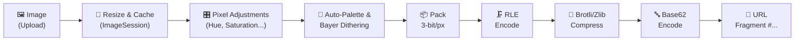
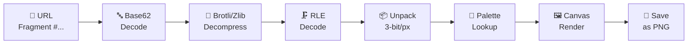

<div style="display: flex; justify-content: center; align-items: center; flex-direction: column;">

<h1>🔮 NanoGlyph — Share Images Without Internet</h1>
<br>
<br>
</div>

> [!NOTE]  
> What if you could share photos using just a URL — no server, no cloud, no internet required?

NanoGlyph is an offline-first Progressive Web App (PWA) that encodes images into compact, URL-safe text. Share images via messaging apps on restrictive WiFi networks, air-gapped environments, or anywhere traditional image sharing fails.

> [!TIP]
> **[🚀 Try it Live](https://ghagui.github.io/NanoGlyph-Share/)**

---

## 💡 Why NanoGlyph?

The idea came from a real frustration: **restrictive WiFi networks** (airports, hotels, corporate) that block image uploads but allow text messages. What if the image *was* the message?

NanoGlyph solves this by:
- **Encoding** any image into a compact Base62 string
- **Embedding** it directly in the URL fragment (`#...`)
- **Decoding** it entirely in-browser — no server ever sees the data

The entire image lives in the link. Send it via WhatsApp, Telegram, SMS, email — anything that can carry text.

---

## ✨ Features

| Feature | Description |
|---------|-------------|
| 🎨 **99 Color Palettes** | 20 hand-crafted + 79 procedural palettes with Auto/Manual toggle |
| 🎛️ **Responsive Adjustments** | Preview work runs in a dedicated Web Worker, keeping the interface responsive |
| 🚀 **Aggressive PWA** | Custom Service Worker bypasses "stuck cache" bugs standard to mobile PWAs for guaranteed updates |
| 📱 **Platform-Aware Chunking** | Auto-splits URLs for WhatsApp (4K), Telegram (4K), Messenger (2K), Instagram (1K) |
| 🖼️ **Multi-Format Support** | PNG, JPEG, GIF, WebP, BMP, HEIF/HEIC — including animations |
| 💾 **Save as PNG** | Download received images directly to your gallery with one tap |
| 🔒 **Zero Server** | Everything runs in your browser via WebAssembly — no data leaves your device |
| 📶 **Offline-First** | Works without internet after first visit — self-contained ImageSession Wasm layer |
| ⚡ **Rust + WebAssembly** | Image processing at near-native speed using Bayer dithering and RLE |
| 🗜️ **Adaptive Compression** | Brotli quality is selected by payload size, with maximum Brotli and Zlib overrides |
| 🎚️ **Quality Control** | Low (64px) to Cosmic (2048px) — you choose the tradeoff |
| 🤖 **Android App** | Capacitor 8 package for Android 7+, native sharing, gallery save, and verified App Links |

---

## 🔧 How It Works

### Encoding Pipeline


```mermaid
flowchart LR
    A["🖼️ Image\n(Upload)"] --> B["📐 Resize & Cache\n(ImageSession)"]
    B --> C["🎛️ Pixel Adjustments\n(Hue, Saturation...)"]
    C --> D["🎨 Auto-Palette & \nBayer Dithering"]
    D --> E["📦 Pack\n3-bit/px"]
    E --> F["🗜️ RLE\nEncode"]
    F --> G["💨 Brotli/Zlib\nCompress"]
    G --> H["🔤 Base62\nEncode"]
    H --> I["🔗 URL\nFragment #..."]
```

### Decoding Pipeline


```mermaid
flowchart LR
    A["🔗 URL\nFragment #..."] --> B["🔤 Base62\nDecode"]
    B --> C["💨 Brotli/Zlib\nDecompress"]
    C --> D["🗜️ RLE\nDecode"]
    D --> E["📦 Unpack\n3-bit/px"]
    E --> F["🎨 Palette\nLookup"]
    F --> G["🖼️ Canvas\nRender"]
    G --> H["💾 Save\nas PNG"]
```

**Step by step:**

1. **Resize** — Scale to target dimension (64–2048px) and cache in WebAssembly RAM
2. **Adjust** — Apply Exposure, Contrast, Saturation, Hue, and Temperature mathematically
3. **Palette** — Auto-detect or manually lock one of 99 palettes (8 colors each)
4. **Dither** — Bayer ordered dithering for smooth color transitions
5. **Pack** — 3 bits per pixel (8 colors = 3 bits, 62% size reduction vs 8-bit)
6. **RLE** — Run-length encoding for repeated color runs
7. **Compress** — Adaptive Brotli (Q6/Q9/Q11), maximum Brotli, or Zlib compatibility mode
8. **Base62** — URL-safe encoding using grouped radix conversion over `A-Za-z0-9`

The result is a self-contained URL like:
```
https://ghagui.github.io/NanoGlyph-Share/#2s54FcFnAlWr...
```

---

## 🛠️ Tech Stack

- **Rust** — Core image processing, compression, and Base62 encoding
- **WebAssembly** — Compiled from Rust via `wasm-pack` for browser execution
- **Web Worker** — Isolates image loading, previews, encoding, and decoding from the UI thread
- **Vanilla JS/CSS/HTML** — Zero-dependency frontend, no frameworks
- **Capacitor 8** — Android 7+ shell with native share and MediaStore integration
- **Service Worker** — Offline caching for PWA support
- **GitHub Actions** — Tests, GitHub Pages deployment, debug APK CI, and signed APK/AAB releases

---

## 🏗️ Build from Source

### Prerequisites

- [Rust](https://rustup.rs/) with `wasm32-unknown-unknown` target
- [wasm-pack](https://rustwasm.github.io/wasm-pack/installer/)
- Node.js 22+
- For Android: JDK 21 and Android SDK Platform 36

### Web build

```bash
npm ci
npm run test:rust
npm run build:web
```

### Run locally

```bash
python3 -m http.server 8080 --directory dist
# Open http://localhost:8080/
```

### Android debug APK

```bash
npm run cap:sync
cd android
./gradlew test lint assembleDebug
# app/build/outputs/apk/debug/app-debug.apk
```

### Signed release APK and AAB

Provide the release keystore through environment variables; the private key is never
stored in the repository:

```bash
export ANDROID_KEYSTORE_PATH=/absolute/path/to/release.jks
export ANDROID_KEYSTORE_PASSWORD='...'
export ANDROID_KEY_ALIAS='...'
export ANDROID_KEY_PASSWORD='...'

npm run android:release -- -PversionCode=1 -PversionName=0.2.0
```

Release artifacts are written to:

```text
android/app/build/outputs/apk/release/app-release.apk
android/app/build/outputs/bundle/release/app-release.aab
```

The tag workflow (`v*.*.*`) performs the same signed build using GitHub Actions
secrets. See [`app-links/README.md`](./app-links/README.md) for the one-time
Digital Asset Links setup required for verified links.

---

## 📊 Compression Examples

| Source | Quality | Palette | Chunks (WhatsApp) | URL Length |
|--------|---------|---------|-------------------|------------|
| Photo (1080p) | Medium (128px) | Auto | 1 | ~8,000 chars |
| Photo (1080p) | High (192px) | Auto | 5 | ~18,000 chars |
| Photo (1080p) | Extreme (256px) | Auto | 7 | ~28,000 chars |
| Icon (64x64) | Low (64px) | Auto | 1 | ~800 chars |

---

## 🎨 Palette System

NanoGlyph includes **99 palettes**:

- **#0** — Default (RGB primaries)  
- **#1** — Classic CGA  
- **#2** — Real Photography Colors  
- **#3-#20** — Themed (Portraits, Cinema, Vintage, Cyberpunk, Food, etc.)  
- **#21-#98** — Procedural (full 360° hue spectrum)

Each palette contains **8 colors**, and the encoder automatically selects the best-matching palette for your image.

---

## 📋 Platform Hyperlink Limits

> [!IMPORTANT]
> Messaging apps auto-hyperlink URLs only up to a certain length. Beyond that, the URL is sent as **plain text** — the receiver must manually copy-paste it into the browser.

| Platform | Clickable Link Limit | Auto-Chunk |
|----------|---------------------|-----------------|
| WhatsApp | ~4,096 chars | ✅ |  
| Telegram | ~4,096 chars | ✅ |
| Messenger | ~2,000 chars | ✅ |
| Instagram | ~1,000 chars | ✅ |

NanoGlyph chunks based on the clickable limit so every shared part is a tappable link.

---

## 📄 License

[GNU Affero General Public License v3](./LICENSE).

HEIF/HEIC decoding uses the vendored `heic-to` 1.5.2 library under LGPL-3.0; its license is included at [`vendor/heic-to-LICENSE.txt`](./vendor/heic-to-LICENSE.txt).

---

<p align="center">
  <strong>❤️ Made by <a href="https://ghagui.github.io/Gabriel_Hagui/">Gabriel Hagui</a> in Rust</strong>
</p>
