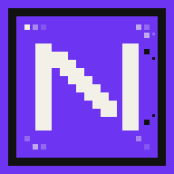
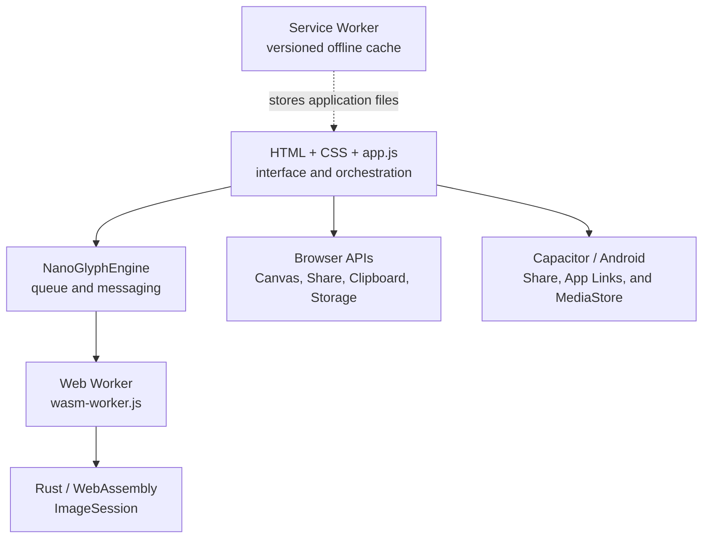

<p align="center">
  
</p>

<h1 align="center">NanoGlyph</h1>

<p align="center">
  <strong>Images inside links, with no uploads and fully local processing.</strong>
</p>

<p align="center">
  <a href="https://ghagui.github.io/NanoGlyph-Share/">Open the web app</a>
  ·
  <a href="#how-to-use-it">How to use it</a>
  ·
  <a href="#how-it-works">How it works</a>
  ·
  <a href="#local-development">Development</a>
</p>

## What it is

NanoGlyph is an image encoder and decoder that runs directly on your device. Instead of uploading a file to a server, it reduces the image, maps its colors to an 8-color palette, compresses the pixels, and turns the result into Base62 text. That text is placed in the URL fragment, after the `#` character:

```text
https://ghagui.github.io/NanoGlyph-Share/#2s54FcFnAlWr...
```

The link contains the image. When someone opens it, the same application reverses the process and reconstructs the image in a `<canvas>`.

This is different from a conventional link to a photo: there is no identifier pointing to a file in the cloud, and no image is stored on a NanoGlyph backend. The `#...` fragment is also not included in the HTTP request sent to the server hosting the application.

> **Important:** NanoGlyph does not preserve the original image. The process is intentionally lossy: it reduces resolution and colors to make the content small enough to fit in text. The result has a pixel-art/dithered appearance and may produce very long links.

## What it is for

The project was designed for situations where text can get through more easily than attachments, for example:

- restrictive networks that allow messages but block media uploads;
- sending a small image through WhatsApp, Telegram, Messenger, Instagram, SMS, or email;
- environments where no server is available to receive the photo;
- creating limited-palette pixel-art versions of images;
- demonstrating image processing, compression, and WebAssembly in the browser.

It is best suited to small images, icons, visual references, and low-resolution photos. It is not a replacement for photo storage, original-quality sharing, end-to-end encryption, or a CDN.

## What “offline” means here

All encoding and decoding happens locally, including in the browser. After the PWA has been opened at least once and its files have been stored by the Service Worker, it can work without a connection. The Android application already includes these files in its package.

The first visit to the web version still requires the application to be loaded from GitHub Pages. The channel used to transport the link may also require a network connection. “Offline” means NanoGlyph does not need to send the image to an API or fetch the encoded content from a server; it does not mean a new browser can open the site for the first time without internet access.

## Features

- local processing in Rust compiled to WebAssembly;
- framework-free interface built with HTML, CSS, and JavaScript;
- previews and expensive operations run in a Web Worker, outside the UI thread;
- 99 eight-color palettes: 21 hand-authored and 78 generated procedurally;
- automatic palette matching or manual selection;
- configurable maximum output dimension from 64 to 2048 px;
- rotation, mirroring, exposure, contrast, saturation, hue, and temperature controls;
- ordered dithering with a 4×4 Bayer matrix;
- adaptive Brotli, maximum Brotli, or Zlib compatibility mode;
- automatic splitting into multiple links based on the selected platform;
- PNG, JPEG, GIF, WebP, and BMP support in the Rust core;
- local HEIF/HEIC conversion to JPEG before the image enters the core;
- animated GIF support for up to 5 frames;
- PWA installation and offline operation after the first load;
- Android 7+ application with native sharing, gallery saving, and App Links;
- export of the preview or received image as a nearest-neighbor upscaled PNG.

## How to use it

### Create a link

1. Open the [web app](https://ghagui.github.io/NanoGlyph-Share/) or the Android application.
2. Select or drag in an image up to 32 MiB.
3. Choose the output scale. `128px` is the default and usually provides a good balance between readability and link size.
4. Use automatic palette matching or browse the 99 palettes manually.
5. Optionally rotate, mirror, or adjust the image colors.
6. Select a compression mode and the platform through which the link will be sent.
7. Select **Encode Magic Link**.
8. Share or copy the generated link.

The larger the scale, the more pixels need to be transported and the longer the link tends to become. Photographs and noisy images compress less effectively than illustrations with large areas of repeated colors.

### Receive a single link

Open the complete link. The application reads the fragment, decodes its contents, and displays the image. The save button exports the currently visible frame as a PNG.

The link is not secret: anyone with access to the full address can reconstruct the image. It may also remain in browser history, the clipboard, and messaging applications.

### Receive an image split into parts

Messaging applications do not always recognize very long URLs as clickable links. When the result exceeds the selected limit, NanoGlyph creates parts in this format:

```text
https://ghagui.github.io/NanoGlyph-Share/#/1-3/FIRST_PART
https://ghagui.github.io/NanoGlyph-Share/#/2-3/SECOND_PART
https://ghagui.github.io/NanoGlyph-Share/#/3-3/THIRD_PART
```

Every part must be opened in the same browser profile on the same device. Parts are stored temporarily in `localStorage`; once all of them arrive, they are concatenated in the correct order, removed from storage, and decoded automatically. Do not mix parts from different images that have the same total part count.

The limits used by the interface are conservative presets, not guarantees made by the platforms:

| Route | Limit used for each URL |
| --- | ---: |
| WhatsApp | 4,096 characters |
| Telegram | 4,096 characters |
| Messenger | 2,000 characters |
| Instagram | 1,000 characters |

The code also limits a NanoGlyph Base62 payload to 8 MiB, accepts at most 10,000 parts, and never creates a URL longer than the internal ceiling of 32,779 characters.

## How it works

### Architecture overview


```mermaid
flowchart TD
    UI["HTML + CSS + app.js<br>interface and orchestration"]
    EC["NanoGlyphEngine<br>queue and messaging"]
    WW["Web Worker<br>wasm-worker.js"]
    WASM["Rust / WebAssembly<br>ImageSession"]
    PWA["Service Worker<br>versioned offline cache"]
    WEB["Browser APIs<br>Canvas, Share, Clipboard, Storage"]
    AND["Capacitor / Android<br>Share, App Links, and MediaStore"]

    UI --> EC --> WW --> WASM
    UI --> WEB
    UI --> AND
    PWA -. stores application files .-> UI
```

`app.js` controls the interface and does not call Wasm directly. `engine-client.js` maintains a request queue, discards obsolete previews, and communicates with `wasm-worker.js` through messages. The Worker initializes the Wasm module, keeps a single `ImageSession` in memory, and returns RGBA buffers as transferable objects, avoiding additional copies back to the main thread.

During the build, esbuild bundles the JavaScript imported by `app.js`. The Worker and the glue code generated by `wasm-pack` remain separate modules inside `dist/`.

### Encoding pipeline


```mermaid
flowchart LR
    A["Local file"] --> B["Decoding and<br>safety limits"]
    B --> C["Rotation / mirroring"]
    C --> D["Resize"]
    D --> E["Color adjustments"]
    E --> F["Palette selection"]
    F --> G["Bayer 4×4 +<br>3-bit indices"]
    G --> H["Frame deltas<br>for GIFs"]
    H --> I["Bit packing + RLE"]
    I --> J["Header + compression"]
    J --> K["Base62"]
    K --> L["URL fragment"]
```

1. **Image loading:** the core detects the format from the file contents. GIFs are read as animations; other formats produce a single frame. HEIF/HEIC first passes through the bundled `heic-to` library and becomes a JPEG at quality `0.92`.
2. **Session and cache:** `ImageSession` keeps the decoded frames and reuses the resized version across previews and final encoding. Changing rotation or mirroring invalidates this cache.
3. **Transform and scale:** rotation and mirroring happen before resizing. Aspect ratio is preserved, and smaller images are not enlarged.
4. **Adjustments:** exposure, contrast, saturation, hue rotation, and temperature are applied in Rust after the image has been resized.
5. **Palette:** in automatic mode, up to 16,384 pixels are sampled. The algorithm evaluates all 99 palettes and selects the one with the lowest squared RGB error for the image.
6. **Quantization:** each pixel is perturbed by a 4×4 Bayer matrix and assigned to the closest of the palette's 8 colors. The resulting index occupies 3 bits.
7. **Animation:** the first GIF frame is stored in full. In subsequent frames, each index stores the modulo-8 difference from the previous frame. At most 5 frames are used.
8. **Compaction:** indices are bit-packed, repeated bytes pass through RLE, and the payload receives a 7-byte header.
9. **Compression:** the binary payload uses Brotli or Zlib and receives a byte identifying the codec.
10. **Text and URL:** the result is converted with the Base62 alphabet `0-9A-Za-z` and appended to the canonical URL fragment.

Adaptive Brotli selects quality 11 for payloads up to 32 KiB, quality 9 up to 256 KiB, and quality 6 above that. Maximum mode fixes the quality at 11. Zlib mode uses the library's highest compression level and maintains compatibility with older links.

### Payload format

In compact notation, a link contains:

```text
Base62(codec || compress(header || RLE(pack(pixel_indices))))
```

The decompressed header is 7 bytes long:

| Offset | Size | Field | Description |
| ---: | ---: | --- | --- |
| 0 | 1 byte | `version` | Format version, currently `1` |
| 1 | 2 bytes | `width` | `u16` width, little-endian |
| 3 | 2 bytes | `height` | `u16` height, little-endian |
| 5 | 1 byte | `palette_id` | Palette from `0` to `98` |
| 6 | 1 byte | `flags` | Bit 0 marks animation; bits 1–3 store the frame count |

The header is followed by RLE `[count, byte]` pairs. The codec byte sits outside the compressed block: `0x42` (`B`) for Brotli and `0x5A` (`Z`) for Zlib. Older links without this marker are interpreted as Zlib.

### Decoding pipeline

The decoder validates the Base62 text, identifies the codec, decompresses the contents, reads the header, expands the RLE data, unpacks the 3-bit indices, and reverses animation deltas. It then replaces each index with the corresponding palette color and produces RGBA data for the canvas.

Defensive limits allow 8 MiB for Base62 text, 16 MiB for decompressed contents, and 32 MiB for RGBA output. Received dimensions must be between 1 and 2048 px on each axis, the palette must exist, and animations cannot exceed 5 frames.

## Palettes

Each palette contains exactly 8 colors:

- `0`: grayscale;
- `1`: standard web colors;
- `2`: general photographic colors;
- `3–20`: themed sets such as portrait, teal & orange, winter, analog film, urban neon, golden hour, food, beach, cyberpunk, sepia, and astrophotography;
- `21–98`: procedural palettes distributed across the hue spectrum.

The palette is not included in the payload as 24 RGB bytes; only its identifier is stored in the header. The encoder and decoder must therefore share the same palette definitions.

## Limits and design decisions

| Aspect | Current behavior |
| --- | --- |
| Input file | Up to 32 MiB |
| Source dimensions accepted by the decoder | Up to 4096 × 4096 px |
| Static image retained in the session | Up to 2048 px on the longest axis |
| GIF retained in the session | Up to 1024 px on the longest axis and 5 frames |
| Available output scales | 64, 96, 128, 160, 192, 224, 256, 512, 1024, and 2048 px |
| Colors | 8 per image; transparency is discarded and output is opaque |
| Animation | GIF only; original timing is not preserved and playback uses 200 ms per frame |
| HEIF/HEIC | Converts the decodable image to JPEG before processing |
| PNG export | Uses nearest-neighbor scaling to reach approximately 2560 px in width |
| Confidentiality | No encryption, password, expiration, or access control |

Very large links may be truncated by the browser, messaging application, operating system, or an intermediate service. Splitting the payload addresses hyperlink-detection limits, but it does not turn the format into an efficient transport for large images.

## Privacy and security

- The project implements no upload endpoint, user account, or telemetry.
- The original image and payload are processed on the device.
- The server delivering the PWA receives the normal page request, but browsers do not send the `#...` fragment as part of that request.
- Required assets, including the HEIF converter, are served from the application package and included in the offline cache.
- The application requests persistent storage when the API is available; the browser may still deny the request or remove data according to its own policy.
- The **Clear Local Cache** button deletes caches, `localStorage`, and Service Worker registrations before reloading.
- A NanoGlyph link should be treated like the file itself: anyone who obtains the text can decode it.

## Technology stack

| Layer | Technology | Responsibility |
| --- | --- | --- |
| Interface | HTML, CSS, and JavaScript ES modules | Desktop/mobile flows, preview, canvas, and sharing |
| Processing | Rust + `image` | Decoding, transforms, palettes, dithering, and pixels |
| Web runtime | WebAssembly + `wasm-bindgen` | Bridge between JavaScript and the Rust core |
| Concurrency | Web Worker | Keeps expensive work outside the UI thread |
| Compression | Brotli, Zlib, RLE, and Base62 | Reduces and serializes the payload for the URL |
| PWA | Manifest + Service Worker | Installation and versioned offline cache |
| Android | Capacitor 8 + Java | Native shell, Share API, App Links, and MediaStore |
| Build | wasm-pack + esbuild | Compiles Wasm and generates `dist/` |
| Automation | GitHub Actions | Pages deployment, Android verification, and signed releases |

## Repository structure

```text
.
├── app.js                    # Main interface controller
├── engine-client.js          # Worker RPC client and preview queue
├── wasm-worker.js            # Worker ↔ WebAssembly adapter
├── native-platform.js        # Web and Capacitor platform differences
├── share-chunks.js           # Link validation, splitting, and reassembly
├── index.html / style.css    # Interface and responsive design
├── sw.js / manifest.json     # PWA and offline cache
├── nanoglyph_core/           # Rust crate and wasm-bindgen API
│   └── src/
│       ├── session.rs        # Session, cache, transforms, and encoding
│       ├── encoder.rs        # Adjustments, dithering, RLE, compression, Base62
│       ├── decoder.rs        # Validation and RGBA reconstruction
│       ├── palette.rs        # 99 palettes
│       ├── pixel_data.rs     # 3-bit packing/unpacking
│       └── lib.rs            # Format types and Wasm interface
├── scripts/build-web.mjs     # Build pipeline for dist/
├── tests/                    # JavaScript chunking tests
├── vendor/                   # heic-to and its LGPL license
├── android/                  # Android project managed by Capacitor
├── app-links/                # Digital Asset Links template and instructions
└── .github/workflows/        # Web, Android, and release CI
```

`dist/`, `node_modules/`, Rust artifacts, and Android builds are generated locally and ignored by Git.

## Local development

### Prerequisites

- Node.js 22 or newer;
- stable Rust;
- the `wasm32-unknown-unknown` target;
- `wasm-pack` available in `PATH`;
- for Android: JDK 21 and Android SDK Platform 36.

Install the target and dependencies:

```bash
rustup target add wasm32-unknown-unknown
npm ci
```

### Web build and local server

```bash
npm run build:web
python3 -m http.server 8080 --directory dist
```

Then open `http://localhost:8080/`. The contents of `dist/` must be served over HTTP; opening `index.html` directly does not provide the correct environment for modules, the Worker, Wasm, and the Service Worker.

The build performs these steps:

1. recreates `dist/`;
2. compiles `nanoglyph_core` in release mode with `wasm-pack --target web`;
3. bundles and minifies `app.js` with esbuild;
4. copies the HTML, CSS, Worker, icons, and HEIF dependency;
5. injects the `package.json` version into the bundle and Service Worker cache name.

`./build.sh` is a shortcut for `npm run build:web`.

### Tests

```bash
# Rust core unit tests
npm run test:rust

# Chunk validation, splitting, and reassembly tests
npm run test:web

# Rust + JavaScript + complete web build
npm test
```

The Rust tests cover the header and flags, pixel packing, RLE, Base62, rotation, and session-cache invalidation. The JavaScript tests exercise payloads with hundreds of parts, the full 8 MiB budget, and rejection of invalid metadata.

## Android

The native app uses `dist/` as its web content. `cap:sync` always rebuilds the web application before synchronizing assets and plugins with the Android project.

### Debug APK

```bash
npm run android:debug
```

To also run tests and lint as CI does:

```bash
npm run cap:sync
cd android
./gradlew test lint assembleDebug
```

The APK is written to `android/app/build/outputs/apk/debug/app-debug.apk`.

### Signed release

```bash
export ANDROID_KEYSTORE_PATH=/absolute/path/to/release.jks
export ANDROID_KEYSTORE_PASSWORD='...'
export ANDROID_KEY_ALIAS='...'
export ANDROID_KEY_PASSWORD='...'

npm run android:release -- -PversionCode=1 -PversionName=0.2.0
```

Generated artifacts:

```text
android/app/build/outputs/apk/release/app-release.apk
android/app/build/outputs/bundle/release/app-release.aab
```

On Android 10+, the plugin saves PNGs to `Pictures/NanoGlyph` through MediaStore. On Android 7–9, it requests the legacy storage permission. Application HTTPS links can open directly in the app, but the domain association must be published and correctly signed; see [app-links/README.md](./app-links/README.md).

## Available scripts

| Command | Result |
| --- | --- |
| `npm run build` | Alias for `build:web` |
| `npm run build:web` | Generates the web application in `dist/` |
| `npm run test:rust` | Runs the crate tests |
| `npm run test:web` | Runs the Node tests |
| `npm test` | Tests Rust and the web code, then validates the build |
| `npm run cap:sync` | Generates `dist/` and synchronizes Android |
| `npm run android:debug` | Builds a debug APK |
| `npm run android:release` | Builds a release APK and AAB |

## Continuous integration

- Push to `main`: tests the core, generates `dist/`, and deploys to GitHub Pages.
- Pull request or push to `main`: synchronizes Capacitor and runs Android tests, lint, and a debug build.
- Tag matching `v*.*.*`: uses signing secrets to produce release APK and AAB artifacts in GitHub Actions.

The keystore must not be committed; `*.jks` and `*.keystore` patterns are already included in `.gitignore`.

## License

NanoGlyph is distributed under the [GNU Affero General Public License v3](./LICENSE).

HEIF/HEIC decoding uses a local copy of `heic-to` 1.5.2 under LGPL-3.0. Its license is available at [vendor/heic-to-LICENSE.txt](./vendor/heic-to-LICENSE.txt).

<p align="center">
  Built by <a href="https://ghagui.github.io/Gabriel_Hagui/">Gabriel Hagui</a> with Rust, WebAssembly, and a lot of pixels.
</p>
